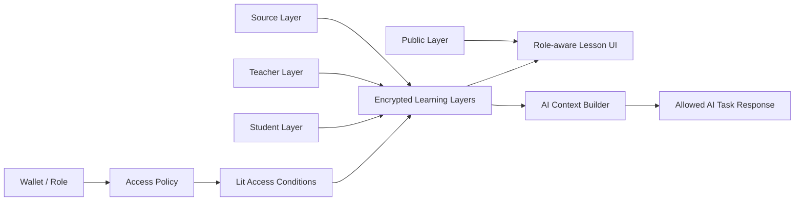
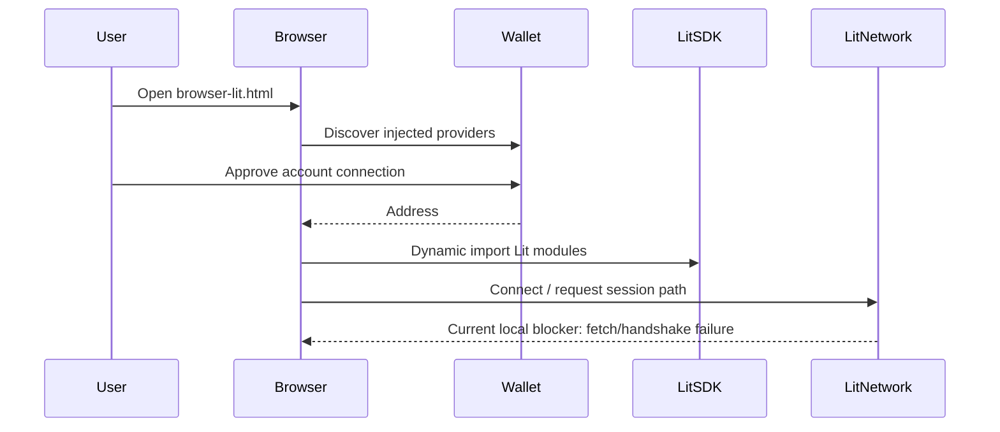

# Architecture Diagram

## Core pattern



## Layer unlock model

```text
public learner
  └─ public layer
      └─ raw observation image

student
  └─ public + student layers
      └─ evidence map unlocked

teacher
  └─ public + student + teacher layers
      └─ reasoning board unlocked

owner
  └─ public + student + teacher + source layers
      └─ 3D/source model slot unlocked
```

## AI context gating model

```text
User role + requested AI task
          ↓
context-builder checks allowed layers
          ↓
only permitted layer text enters AI context
          ↓
denied layer names are reported, not leaked
```

Example:

```text
public_learner + teacher_script
→ denied: teacher layer
→ AI receives only public context or task is blocked
```

## Browser Lit route



Current proven path:

```text
wallet detected → Rabby connected → Lit SDK loaded → diagnostics run → network fetch blocker documented
```

## Why this architecture matters

This is not a single locked page. It separates four concerns:

1. **content model** — reusable `mission.json` layers;
2. **authorization model** — roles and tasks map to allowed layers;
3. **cryptographic access model** — protected layers are mapped to Lit access conditions;
4. **learning experience model** — UI and AI context change as permission depth increases.

That separation is what makes the template reusable for science modules, course platforms, training simulations, interactive docs, and AI-assisted learning flows.
